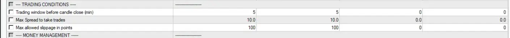

### Overview

**HighPerformanceFX (hpFX)** is an open source, high-performance, indicator-based simulation framework for backtesting large numbers of indicators across multiple currency pairs and historical time periods. 

hpFX is built on top of the **[MetaTrader 4 (MT4)](https://www.metatrader4.com/)** trading platform, which is freely available through many brokers. MT4 was selected as the core engine due to its vast ecosystem of legacy indicators, offering a richer and more diverse indicator library than its successor, MetaTrader 5 (MT5). While MT5 introduces new features, it partially lacks full backward compatibility with MT4, making MT4 the more practical choice for large-scale indicator testing.

hpFX takes inspiration from the [NNFX Algo Tester](https://nnfxalgotester.com/), a well-regarded toolset for backtesting and live trading. While the two are not directly compatible, hpFX uses a similar indicator encoding format, making it possible to reuse indicator definitions across both platforms with minimal adjustments. The tools differ in scope and design focus. hpFX is not intended as a replacement for the NNFX Algo Tester, but rather serves as an open-source solution built independently, with an emphasis on large-scale batch testing and high-throughput performance through parallelization. It is free of licensing restrictions and supports running multiple simulations concurrently.
#### Why hpFX?

hpFX gives users the ability to simulate large numbers of trading algorithms, each using different combinations of indicators, across all supported currency pairs, with a single command. Its built-in parallelism through a custom worker pool significantly speeds up execution and eliminates the risk of human error that comes with manual backtesting.

The real power of hpFX lies in its ability to transform MT4's Strategy Tester into a fully scriptable batch system, eliminating the need for manual intervention. It extends MT4's command-line interface with automated configuration generation and result analysis. This makes it possible to run large-scale experiments to identify the most profitable indicators and their combinations.

In our experience, manually backtesting a single scenario over a 4-year period takes around 20 minutes per currency pair. For just 8 symbols, that adds up to 160 minutes of repetitive effort. With hpFX, the same set of simulations can be executed in seconds to a few minutes. In addition to the massive time savings, automated runs eliminate human error and remove the influence of psychological bias.

Finding the most profitable indicator typically requires a brute-force approach—systematically testing all candidate indicators across all meaningful combinations. To complicate things further, most indicators can be used in multiple ways. For example, if an indicator includes two lines, any of the following scenarios might be worth testing:

* line 1 crosses line 2
* line 2 crosses line 1
* line 1 crosses the zero level
* line 2 crosses the zero level
* line 1 crosses a positive level 
	* cross up 
	* cross down
* line 1 crosses a negative level
	* cross up 
	* cross down
* line 2 crosses a positive level
	* cross up 
	* cross down
* line 2 crosses a negative level
	* cross up 
	* cross down
* ... and many others

Considering that some indicators may come with 5 or more buffers (lines), you can imagine how quickly the list of possible usage scenarios grows. And remember, this is still for a single indicator.

Now, let's assume you want to explore 10 indicators, each with 2 lines, and you keep the usage variations to a modest number of 3, instead of testing every possible combination. Within this set, one indicator gives an Entry signal and the second is used as Confirmation (meaning it gives the same Buy or Sell signal to validate the first one), but you don't know in advance which one plays which role. This scenario gives us:

- All possible pairs of indicators from the 10 available:
        - `C(10, 2) = 45` unique pairs. 
- For each pair, we must account for both role permutations - one indicator acting as **entry** and the other as **confirming**:
        - `45 × 2 = 90` role-ordered combinations.
- Since each indicator has **3 different usage modes**, we must explore all combinations of how each is applied:
    - `3 (primary) × 3 (confirming) = 9` usage combinations per role pairing.
- Each configuration must be tested across **8 different currency pairs**:
    - `90 × 9 × 8 = 6,480` total simulations.

We end up with **6,480 simulations**, which would take around **270 days** to complete manually, even when working full-time at 8 hours per day. And this is just for a small pool of **10 indicators**. The number of simulations quickly explodes:

- **100 indicators** → 712,800 simulations
- **1,000 indicators** → 89,712,000 simulations

Given that thousands of indicators are freely available online, testing at this scale is not unrealistic for anyone aiming to find the most profitable combinations.

MT4's built-in Strategy Tester offers an **Optimization** feature to sweep through parameter ranges such as stop loss, take profit, or custom indicator inputs. However, MT4 does **not** support automated testing across **different indicator combinations** or **multiple currency pairs**. That’s where **hpFX** comes in. It fills this gap by automating large-scale, cross-pair, cross-indicator simulations - something that’s otherwise impractical or impossible to do with standard MT4 tools alone.

## The hpFX Expert Advisor (EA)

At the core of hpFX is the **hpFX EA** (`hpFX_Engine.mq4`), an indicator-agnostic Expert Advisor designed to apply user-defined trade rules using nearly any kind of indicator. While it loosely adopts the indicator encoding style of the NNFX Algo Tester, its property files (`.set`) are not compatible between the two tools. The hpFX EA is fully standalone and can also be used independently of the hpFX platform to run individual experiments or custom strategies manually.
### Indicator Roles 

hpFX supports assigning distinct roles to multiple indicators within the same strategy configuration. This role-based structure enables the implementation of a wide range of algorithmic scenarios, including those popularized by the [No Nonsense Forex (NNFX)](https://nononsenseforex.com/) blog and podcast series.

By specifying how each indicator contributes to trade decisions, whether as an entry trigger, confirmation filter, trade conditionals, or exit signal, researchers can recreate established frameworks or design entirely new ones, all through configuration rather than code.

These roles are as follows:


**`TRADEORNOT`:** These determine whether market conditions are appropriate for trading, regardless of direction. If this indicator blocks a trade, signals from other indicators are ignored. In NNFX terminology, these are often called "Volume" or "Volatility" Indicators because they are usually based on Volume and Volatility related metrics. 

**`SIGNAL`:** Also known as "Confirmation Indicators" in NNFX, these generate the primary Buy or Sell signals. In hpFX, they are often called "Entry" indicators because they initiate trade entries.

**`CONFIRMATION`**: These indicators validate the direction of an Entry signal. They must agree with the direction of the Entry, but do not need to trigger at the same time. For instance, if both use a line cross and the Confirmation crosses first, the signal is still valid as long as it remains aligned when the Entry trigger occurs. Multiple confirmation indicators can be used in a strategy.

**`EXIT`:** These indicators signal when to close an active trade. hpFX automatically reverses the signal direction, so EXIT indicators should be configured exactly as they would be in the SIGNAL role - no changes are needed. It’s possible (and often common) to reuse the same indicator used for entry.

**`SIGNALEXIT`:** A special type of Entry indicator that opens a trade when triggered and closes it when the signal reverses. It behaves the same as using the same indicator for both Entry and Exit, but simplifies configuration and frees up an extra slot in the Set file for another indicator.

**`STOPLOSS`:** This role dynamically adjusts the stop loss based on the value of a specified indicator. It supports only a single buffer. A common example is using a Moving Average to exit the trade when the price crosses it. Baseline indicators are also well suited for this role.

**`DISABLED`:** This role disables the indicator so it is ignored during execution. It is useful for testing when you want to temporarily exclude an indicator without removing its configuration from the Set file.

#### hpFX Expert Advisor Input

In all modes, at least one indicator must define the entry condition. All other roles are optional and ignored if not provided. For example, if no Exit indicator is defined, trades will close at the Take Profit (TP) level specified in the `.set` file.


hpFX EA input interface lists all available features. All options under the `VARIOUS` and `ROULETTE MM` sections are currently considered experimental and are not included in this documentation.

##### hpFX Indicator Representations

hpFX Expert Advisor supports multiple indicator categories and can execute most MQL4 indicators as users define them. MT4 indicators store their visual and logical components using **buffers**, with each buffer holding values for a specific element (such as a line, symbol, or non-drawn calculation). Indicators can have multiple buffers - for instance, one with two lines and two arrows would require at least four buffers to represent its full logic.

hpFX uses a 3-field format to represent each indicator definition, separated by the pipe (`|`) character:

```
GIVEN_NAME | TYPE | INDICATOR_FILE_AND_BUFFERS
```

**`GIVEN_NAME`:** A user-defined name for this indicator configuration. It should ideally describe the indicator and how it's being used.  **Avoid special characters and white spaces** as this name will be used to generate filenames.  
It is common to define multiple variants for the same indicator. Examples:

```
my_indicator_b1xb2 ->  buffer1 crosses buffer2
my_indicator_b1x0  ->  buffer1 crosses zero line
my_indicator_b2x0  ->  buffer2 crosses buffer1
```

**`TYPE`:** The type of the indicator picked from the list of supported hpFX indicator types. Supported types are:

- `BASELINECROSS`
- `TWOLINESCROSS`
- `ONELEVELCROSS`
- `TWOLEVELCROSS`
- `SLOPE`
- `HISTOGRAM`
- `LINEMACROSS`
- `ARROWS`

These types are explored in detail in the following sections.

**`INDICATOR_FILE_AND_BUFFERS`:** The indicator filename and which buffers to use. The filename must be given relative to `<mq4_data_folder>\MQL4\Indicators`. This field consists of three parts, separated by semicolons (`;`)

> [!WARNING] 
> hpFX support for custom indicator parameters is a work in progress. Currently, hpFX only works with default indicator settings. If you want to test an indicator with non-default parameters, you can create a copy, apply your changes, and save it with those settings as the default. The `TBD_leave_blank` fields in the following sections are placeholders for this future feature and must be left blank for now.]

> [!WARNING] 
> MT4 uses zero-based indexing for buffers, starting from `buffer #0`. In contrast, hpFX uses one-based indexing, so MT4’s `buffer #0` corresponds to `buffer #1` in hpFX, `buffer #1` maps to `buffer #2`, and so on. 


##### `BASELINECROSS`


**Definition:** The `BASELINECROSS` category is used for indicators drawn as a single line on the price chart, typically serving as a "Baseline" in NNFX-style algorithms. It requires one buffer that represents the line's value at each point in time. Moving Averages are common examples, though many other indicators function similarly.

**Signal:** A Buy signal is triggered when the price crosses above the baseline. A Sell signal is triggered when the price crosses below it.

**Representation:**

```
<GIVEN_NAME> |BASELINECROSS| <TBD_leave_blank>;<indicator_file>;<buffer>
```

**Example:**


##### `TWOLINESCROSS`


**Definition:** The `TWOLINESCROSS` category is used for indicators that provide at least two buffers representing lines that can cross each other.

**Signal:** Triggers a Buy signal when `buffer1` crosses above `buffer2`, and a Sell signal when `buffer1` crosses below `buffer2`.

**Representation:**

```
<GIVEN_NAME> |TWOLINESCROSS| <TBD_leave_blank>;<indicator_file>;<buffer1>,<buffer2>
```

**Example:**


##### `ONELEVELCROSS`


**Definition:** The `ONELEVELCROSS` category is used for indicators with a single buffer that can cross a fixed numeric level. A common use case is detecting when a value crosses the zero line. The level can be any numeric value, not just an integer.

**Signal:** Triggers a Buy signal when `buffer1` crosses above the specified level, and a Sell signal when it crosses below.

**Representation:**

```
<GIVEN_NAME> |ONELEVELCROSS| <TBD_leave_blank>;<indicator_file>;<buffer>;<level> 
```

**Example:**


##### `TWOLEVELCROSS`


**Definition:** The `TWOLEVELCROSS` category is used for indicators with a single buffer that can cross both an upper and a lower level, typically numeric values. A common use case is with oscillators like Stochastic, which fluctuate between two thresholds.

**Signal:** Sends a Buy signal when the buffer crosses _above_ the upper level, and a Sell signal when it crosses _below_ the lower level.

To reverse this behavior, prefix the buffer index with a minus sign (`-`).

| **Crossing Direction** | **Level**     | **Default Action** | **Reverted Action** |
| ---------------------- | ------------- | ------------------ | ------------------- |
| Crosses **above**      | **2nd level** | BUY                | SELL                |
| Crosses **below**      | **1st level** | SELL               | BUY                 |

**Representation:**

```
<GIVEN_NAME> |TWOLEVELCROSS| <TBD_leave_blank>;<indicator_file>;<(+/-)buffer>;<first_level>,<second_level>  
```

**Examples:**

**Default Case:** Buy when the buffer #6 crosses above the 80 level, Sell then it crosses below the 20 level.


**Reverted Case:** Buy when the buffer #6 crosses below the 20 level, Sell when it crosses above the 80 level.


##### `SLOPE`


**Definition:** The `SLOPE` category is used to generate Buy/Sell signals based on the direction of an indicator’s slope. Most indicators that produce a continuous line, including many used as baselines, can be applied this way. Unlike `BASELINECROSS`, `SLOPE` also works with indicators that are not plotted directly on the price chart.

>[!warning] The `SLOPE` category can only be used with indicators that store all values in a single, continuous buffer. It is not suitable for indicators that alternate between two buffers. For those, use the `HISTOGRAM` category, which correctly captures their behavior.

Example: 


In this example, the `LSMA_Color` indicator always uses buffer #1 (named 'LSMA_Color') to store the full curve, making it compatible with the `SLOPE` category. It also uses buffer #2 (`Value 2`) to hold values when the curve is sloping up (green), and buffer #3 (`Value 3`) when sloping down (red). This structure allows it to be used with the `HISTOGRAM` category as well, if desired, with identical results.

**Signal:** Sends a Buy signal when the curve starts sloping up, and a Sell signal when it starts sloping down.

**Representation:**

```
<GIVEN_NAME> |SLOPE| <TBD_leave_blank>;<indicator_file>;<buffer>  
```

**Example:**


##### `HISTOGRAM`


**Definition:** The `HISTOGRAM` category is used for indicators that rely on two alternating buffers, typically toggling between a positive value and 0 (or `EMPTY_VALUE`). Only one buffer should be active at a time - when one shows a value (e.g. `1`), the other must be zero or empty, and vice versa.

As noted in the `SLOPE` category, some indicators that display color changes directly on the price chart (rather than 'histogram bars' in a separate indicator window) can still be used with the `HISTOGRAM` category (e.g. `LSMA_Color`).

**Example:**


**Signal:** Sends a Buy signal when `buffer 1` changes from 0 or `EMPTY_VALUE` to a positive value. Sends a Sell signal when `buffer 2` changes from 0 or `EMPTY_VALUE` to a positive value. Only one buffer should be active per signal.

**Representation:**

```
<GIVEN_NAME> |HISTOGRAM| <TBD_leave_blank>;<indicator_file>;<buffer1>,<buffer2>  
```

**Example:**


##### `LINEMACROSS`


**Definition:** The `LINEMACROSS` category is used to generate Buy/Sell signals when a buffer crosses above or below its own Moving Average (MA) - not the price MA. hpFX EA calculates the specified MA type and period internally, so there is no need to add a separate MA indicator. This is especially useful for noisy indicators, where smoothing can reduce false signals and highlight more relevant trends.

**Signal:** Sends a Buy signal when the buffer crosses above its MA, and a Sell signal when it crosses below.

**Representation:**

```
<GIVEN_NAME> |LINEMACROSS| <TBD_leave_blank>;<indicator_file>;<buffer1>;<MA_period>,<MA_type>  
```

`MA_type` can be one off the following, matching the [`ENUM_MA_METHOD`](https://docs.mql4.com/constants/indicatorconstants/enum_ma_method) enumeration as defined in MQL4:

* `0` : Simple averaging (SMA)
* `1`: Exponential averaging (EMA)
* `2`: Smoothed averaging (SMMA)
* `3`: Linear-weighted averaging (LWMA)

**Example:**


##### `ARROWS`


**Definition:** The `ARROWS` category is used for indicators that draw arrows, dots, or other symbols on the chart to signal trade events. These indicators typically have at least two buffers - one for Buy signals and one for Sell signals. Each buffer holds a positive number to indicate a signal and `0` or `EMPTY_VALUE` when there is no signal.

**Signal:** Sends a Buy signal when the first buffer (`long_buffer`) contains a positive value, and a Sell signal when the second buffer (`short_buffer`) contains a positive value.

**Representation:**

```
<GIVEN_NAME> |ARROWS| <TBD_leave_blank>;<indicator_file>;<long_buffer>,<short_buffer>
```

**Example:**


#### Trading Conditions



**`Trading window before candle close (min):`** Specifies how many minutes before the end of the current candle the trade should be evaluated and potentially closed. This allows trades to exit slightly ahead of the candle close, helping avoid slippage, spread spikes, and better simulating real-time trading conditions. A value of `0` means the trade closes exactly at the candle close.

`Max Spread to take trades:` Skip a trade if the spread exceeds beyond the given number of pips. This feature only makes sense if the historical data includes spread information. 

`Max allowed slippage in points:` Maximum allowed slippage (in points) when opening or closing a trade.  This defines the acceptable deviation between the requested price and the actual execution price. If the market moves beyond this range before the order is filled, the trade will be rejected. 

**Note:** 100 points = 10 pips on a 5-digit broker. Adjust accordingly based on your broker's price format.

#### Money Management


**`Risk per trade (percent)`**: Defines the percentage of the current account balance to risk on each trade.  

**`1st order risk % (use 100.0 for single trade)`:** Specifies the percentage of the total risk to allocate to the first (initial) trade in a position. If you are using multiple entries (e.g., scaling in), this value determines how much of the total risk is applied to the first order. hpFX currently supports up to two partial orders per trade.

**`1st SL ATR multiplier`:**  Multiplier of  [Average True Range - ATR(14)](https://docs.mql4.com/indicators/iatr) to calculate the initial Stop Loss (1R) for the trade. This follows the NNFX methodology, where ATR is used to size risk based on market volatility.  

**`1st TP ATR multiplier (0 to leave it open)`**: Multiplier of ATR(14) used to set the Take Profit level; set to 0 to disable and rely on exit indicators instead.

**`2nd SL ATR multiplier`**: Multiplier of ATR(14) used to set the Stop Loss level for the second trade in a position. Ignored if `1st order risk %` is `100.0` ; otherwise, it determines the stop loss for the remainder of the risk allocated.

**`2nd TP ATR multiplier (0 to leave it open)`**: Multiplier of ATR(14) used to set the Take Profit level for the second trade. If set to 0, the trade remains open until closed by an exit signal.

**`Do NOT check exit conditions on the first trade`:** **`Do NOT check exit conditions on the first trade`**: Disables the use of the exit indicator for the first trade. The first trade will close only via TP or SL. The exit indicator remains active for the second trade, as per a technique in NNFX methodology.

**`Add current spread to TP`**: Adds the current spread to the calculated Take Profit level to preserve the intended profit margin. 

**`Require matching candle to trade`**: Allows trades only when the candle type matches the trade direction - 'bullish' for Long, 'bearish' for Short. Doji candles are ignored.

**`R to move SL → BE`**: Defines how many R (risk units) in profit are required before moving the Stop Loss to Break Even (Entry price).

The remaining input parameters are considered experimental and are not documented in this release. However, the definition of Doji candles remains relevant for the `Require matching candle to trade` option described above:

**`Percent of daily range for a candle to be considered 'doji'`**: Specifies the maximum size of a candle's body, as a percentage of its total daily range, for it to be classified as a Doji. Candles below this threshold are excluded from the bullish/bearish check when `Require matching candle to trade` is enabled.

## MetaTrader4 (MT4) Installation and Setup

### System Requirements

To run and use hpFX effectively, ensure the following system and software prerequisites are met:

- **Operating System**: Windows 7 or newer
- **Processor**: 2GHz or faster. A processor with **at least 8 physical cores** is recommended to fully leverage hpFX’s parallelization capabilities.
- **Memory**: Minimum 2GB RAM (8GB or more recommended for parallel runs)
- **Storage**: At least **1TB of free disk space**, preferably on an SSD or NVMe drive.  
    > Note: Tick-based historical FOREX data that are exported into MT4 are used to generate FTX files for each timeframe. These files can get very large depending on the number of currency pairs and timeframes being simulated. 
- **MT4 Platform**:
	- An **active demo account** from a broker that supports **MetaTrader 4 (MT4)**
    - The **broker-provided MT4 installer**
* Python Environment**:
    - **Python 3.9** (Anaconda or Miniconda recommended) with these libraries:
	    - pyyaml
	    - beautifulsoup4
	    - lxml

### Step 1: Manual Installation of MT4 instances

hpFX requires multiple MT4 installations to support simulations running in parallel. They can be installed in any desired folder, but we recommend an indexed naming scheme for easier tracking, such as:

- C:\Program Files (x86)\O-C01  
- C:\Program Files (x86)\O-C02  
- C:\Program Files (x86)\O-C03  
- C:\Program Files (x86)\O-C04  
- C:\Program Files (x86)\O-C05  
- C:\Program Files (x86)\O-C06  
- C:\Program Files (x86)\O-C07  
- C:\Program Files (x86)\O-C08

You can find the installation folder option in the "Settings" menu. E.g. for Oanda:


Each instance may need some basic configurations as desired - such was silencing the audible 'Event' notifications. hpFX is capable of logging into broker servers automatically for each instance it launches, but our recommendation is to manually login on (and save) each instance to avoid potential glitches.

Once the installations are ready, with desired settings and login information saved, you are ready to take the next step. At this point, you don't need to make any further changes, including installing new indicators or Expert Advisors (EA), which is all covered in next steps. You can close all open MT4 instances now. 

### Step 2: Global MT4 Setup and Configuration

#### Step 2.a: Prepare The Global Configuration

hpFX uses `config\global_config.yaml` to keep global settings for this framework. This configuration file needs to be customized on each system hpFX will run on. An example setup is as follows:

```yaml
## >>> GLOBAL SHARED FOLDER <<<  
## The main folder for storing experiment configurations and results from all MT4 instances.  
## This folder contains directories that are hard-linked into each MT4 instance.  
## It includes indicators, expert advisors, scripts, test inputs, and result files. 

global_shared_folder: F:\SIM_HPFX_SHARED_FOLDERS  
  
## >>> GLOBAL HISTORY FOLDER <<<  
## MT4 history folder to keep chart history data (both '<data_folder>\history' and '<data_folder>\tester\history')  
## Note that this directory can get very big in size (hundreds of GBs, and even more), especially if you use tick data spanning several years. 
## It's kept separate from 'global_shared_folder', so you can keep it on a different drive is needed.  
global_history_folder: F:\SIM_HPFX_SHARED_FXT_HST  
    
## >>> BROKER SERVER AND LOGIN INFORMATION <<<  
broker_server: <demo_server>  
broker_login: <demo_MT4_username>  
broker_password: <demo_MT4_password>  
    
## >>> MT4 RESULTS FOLDER <<<  
## Don't change this unless you have a very good reason. 
## MT4 refuses to read expert configuration files (_.set) or write report files (_.htm) outside of the tester folder located in its data directory. To address this, hpFX creates a shared tester folder under global_shared_folder to store all input files and results in one centralized location accessible to all MT4 instances.
mt4_results_folder: hpFX_results  
    
## >>> TERMINAL INSTALLATIONS <<<  
## Installation directories for multiple MT4 terminals to be used for algorithm testing. You can add as many as you wish, but usually more than one installation per each physical core on your system will be excessive and inefficient.  
##  
# IMPORTANT: DO NOT USE AN INSTALLATION THAT IS  USED FOR ACTUAL TRADING. hpFX will DESTROY all of the settings.  
mt4_terminals:  
    - C:\Program Files (x86)\O-C01  
    - C:\Program Files (x86)\O-C02  
    - C:\Program Files (x86)\O-C03  
    - C:\Program Files (x86)\O-C04  
  
## If an MT4 instance is already open, hpFX cannot use it for testing. To prevent this from happening, hpFX  must close all open instances first. This should only impact the installations you configured here. If you have other MT4 installations used for real trading, they should be safe.  
closeMt4Instances: true
```

#### Step 2.b: Prepare Shared MT4 and History Data Directories

MetaTrader 4 (MT4) uses a special directory known as the **data folder** to store indicators, Expert Advisors (EAs), configuration files, and other runtime artifacts. Each MT4 installation has its own unique data folder, which is named using a long alphanumeric string (e.g., `44423629312CA8D88814AB1D8A79F550`). This name is a hashed representation of the MT4 installation path, ensuring that each instance maintains its own isolated environment.

To locate this folder in MT4, go to:

**File → Open Data Folder**


In hpFX, each MT4 instance must be a clone of the others - meaning they must all access the same set of indicators, Expert Advisors, and, most importantly, historical ticker data to ensure consistent and reproducible testing. While it is technically possible to manage separate copies of these resources for each instance, this quickly becomes tedious and error-prone. Even small discrepancies can result in inconsistent outcomes. More importantly, each instance requires access to historical chart data (HST and FXT files), which can easily total hundreds of gigabytes when covering multiple years and currency pairs. Maintaining multiple copies of these large datasets is both inefficient and unnecessary.

To simplify this, hpFX provides a setup tool named `bin\bootstrap.py` that links all MT4 instances to a single, shared data directory using hard links. This script automates what would otherwise be a tedious and error-prone process. It uses `config\global_config.yaml` as its input and requires no command-line arguments. Based on the MT4 paths listed under the `mt4_terminals:` section of the configuration file, it identifies all folders that should be shared and creates hard links from each instance's data folder to the central shared structure defined in the same configuration file.

Note that `bin\bootstrap.py` is idempotent and safe to re-run anytime, e.g. when you add new MT4 installations. Any new MT4 installation path added to the configuration will be properly initialized, and existing ones will remain unaffected. However, the script is also destructive: it deletes certain folders and replaces them with hard links. For this reason, it must not be used on production MT4 installations used for live trading.

### Step 3: Download and Export Shared History Data into MT4

MT4 includes a built-in **History Center** that allows users to download and use historical price data. However, the data provided through this service is limited in scope and often inaccurate, making it unsuitable for serious backtesting.

For reliable and consistent results, we strongly recommend downloading high-quality **historical 'Tick' data** for all relevant currency pairs using a third-party data provider. One service we've found to be both reliable and fully compatible with MT4 is **StrategyQuant's [QuantDataManager](https://strategyquant.com/quantdatamanager/)** - it offers a free tier that is sufficient for most use cases, although download speeds on the free plan may be slow.

While the use of a third‑party data manager is beyond the scope of this documentation, it's important to note that applying **broker‑specific properties** to any downloaded historical data is critical for accurate backtesting. QuantDataManager comes with a custom MT4 script, **`ExportProperties.mq4`**, which you run in MT4 to export broker settings (for all supported currency pairs) into `mt4.properties` located in `<MT4 data folder>\MQL4\Files\`. During the data export in QuantDataManager, you can use this `mt4.properties` to apply these settings (using the 'Load other MT4 data specification file' link) before exporting FXT/HST files for MT4. Please see the QuantDataManager documentation for more details. 


[!danger]  Once the data export is complete, you must immediately set the newly generated HST and FXT files to **Read Only** before running any backtests. If MT4 is launched with writable HST/FXT files, it will silently overwrite them with its own versions, which may differ from the downloaded high-quality data. This can lead to inconsistent or invalid backtest results. You can confirm the files are correctly protected by enabling the "Attributes" column in Windows Explorer, which should display "RA". QuantDataManager automatically sets FXT files as Read Only, but the behavior of other tools may vary.


## Running Your First  Simulation

hpFX allows you to define as many simulation cases as you need in the form of YAML files. This configuration largely mirrors the options you can find Strategy Tester's interface, so it should feel familiar to most MT4 users. 


hpFX reads the input from a YAML configuration file and launches MT4’s `terminal.exe` for each simulation. However, it goes well beyond simply running tests:
- Executes simulations across all currency pairs defined in the simulator configuration, automatically and in parallel using multiple MT4 installations.
- Hides MT4 windows during execution, allowing simulations to run silently in the background without the distraction of windows opening and closing.
- Creates a simulation-specific directory that stores all necessary inputs to reproduce the run, along with MT4’s output (HTM report) and a snapshot of the P/L graph. This makes simulations self-contained and easy to re-run for verification.
- Parses MT4’s standard HTM reports and generates a `RESULTS.csv` file summarizing key statistics from all runs in a single, easy-to-analyze table. While MT4’s reports are informative, they are not easy to aggregate or compare - this feature addresses that limitation.

Next steps go over the process of preparing a simulation to be run on a list of currency pairs. 

We'll cover indicator representation formats, supported types (with their encoding) and test modes in later stages of this documentation. For now, let's focus on running a test case only.  
### Prepare a 'Set' file for hpFX's EA  and Verify with a Manual Run

Each Expert Advisor (EA) comes with a standard interface which allows for customization of options. hpFX comes with its own EA called `hpFX_Engine.mq4`. EAs can be customized using the 'Expert properties' interface available in Strategy Tester. 


This interface allows users to make changes before running the simulation, and these configurations can be saved as a 'Set' file (`*.set`). The format and configuration of this set file is covered in other sections of this documentation, but this example basically:
* Uses QQEA indicator as a Entry 'SIGNAL'
* Requires a 'CONFIRMATION' from the 'FX Sniper's Ergodic_CCI' indicator
* Requires 'Chaikin's Volatility' indicator to allow trades ('TRADEORNOT')
* And exists when the Stop Loss (SL) or Take Profit (TP) level is hit, or the 'EXIT' indicator (which is identical to Entry indicator in this example, which is common) signals an 'EXIT' condition. 


> [!important] We recommend running a single case manually to confirm that all indicators function properly and no syntax issues arise, before launching large scale batch experiments. 

> [! information] Sample indicators and a Set file for this example are distributed with hpFX repository under the `Example_Simulation` folder.

You can find these test indicators in hpFX's `Example_Simulation` folder and copy them to `MQL4\Indicators` under your `global_shared_folder`. This will allow you to run a test case manually to test your hpFX setup. 
 
Once a successful case runs, these properties can be saves as a Set file, e.g. `my_test_EA_properties.set`, to be used by hpFX for all of the tests in a batch. Note that hpFX keeps all of these properties identical in a batch run and iterates on the varying currency pairs the same given time period. Different conditions (e.g. different Stop Loss or Take Profit multipliers) would require separate Set files. 

You can go ahead and create a new folder under `<global_shared_folder>\\tester\\<mt4_results_folder>`  and save this Set file as `my_test_EA_properties.set` in preparation to the next step. 

You are now ready to run a test case in parallel, using hpFX on the entire list of symbols, in a fully automated way!

### Run a Fully Automated hpFX Batch in Parallel  

hpFX requires a YAML configuration file that provides the definition of the batch run as input.  

```bash
usage: hpFX.py [-h] [-e EXPERTCONFIG] [-p PAIRS] [-t TIMEFRAME] [-m MODEL] [-s SPREAD] [-from FROM] [-to TO] [-o] [-d] [-r] [-b] -c TESTCONFIG

optional arguments:
  -h, --help            show this help message and exit
  -e EXPERTCONFIG, --expertconfig EXPERTCONFIG
                        hpFX expert configuration file (*.set) relative to the 'global_shared_folder' defined in global config
  -p PAIRS, --pairs PAIRS
                        Either a comma separated list of pairs or one of the user defined lists in testconfig (e.g. ALL, MAJOR, etc.)
  -t TIMEFRAME, --timeframe TIMEFRAME
                        Timeframe that matches the 'Period:' drop down list, e.g. Daily, H1, M15, etc
  -m MODEL, --model MODEL
                        Test Model: 0='every tick', 1='control points', 2='open prices'. Make sure this selection matches the 'TEST MODEL' in expert properties (*.set file).
  -s SPREAD, --spread SPREAD
                        Spread in points. E.g. 35 is 3.5 pips. 'Current' not supported.
  -from FROM, --from FROM
                        Experiment 'From' Date in 'YYYY.MM.DD' format.
  -to TO, --to TO       Experiment 'To' Date in 'YYYY.MM.DD' format.
  -o, --optimization    Enable optimization (this has nothing to do with the runtime performance. It simply checks the Optimization option in Strategy Tester)
  -d, --delete          Delete existing results folders/files and run all tests from scratch.
  -r, --repair          Identifies missing tests compared to the input configuration and runs them. It checks for missing HTM files and blank lines in the Results CSV.
  -b, --bugfix          Starts hpFX in debugging node. generates verbose output and keeps MT4 open after tests.

Required Arguments:
  -c TESTCONFIG, --testconfig TESTCONFIG
                        Test specific configuration file in YAML format
```
The only required argument is `-c TESTCONFIG.yaml`, since this input file can include all of the fields needed to run a batch case. Other command line arguments are offered only for convenience, allowing users to overwrite options without changing the configuration file. This way users don't need to modify it repeatedly to run similar cases that differ slightly for each run. 

For Example, the configuration file may include:

```
TestFromDate: 2021.01.01    
TestToDate: 2025.01.01    
```

and this command line will run the cases between these specified dates:

```
python hpFX.py -c TESTCONFIG.yaml
```

Alternatively, users can experiment with different time ranges and pairs as follows, without having to modify the configuration file. Examples:

```
python hpFX.py -c TESTCONFIG.yaml -from 2022.01.01 -to 2023.01.01
python hpFX.py -c TESTCONFIG.yaml -from 2023.01.01 -to 2024.01.01 --pairs USDCAD,GBPJPY
```

You can find an Example Simulation Configuration YAML File,  named `hpfx_EXAMPLE_SINGLE_BATCH.yaml`, under the `Example_Simulation` folder of hpFX distribution. 

```yaml
## hpFX Simulation Configuration File    
    
## IMPORTANT:  
##  - Command-line arguments take precedence over this input file.  
##  - Only the parameters listed here are supported. Any additional keys, even if valid for terminal.exe, will be ignored.  
  
## The main category name for this collection of tests. You can run other simulations and organize them under this category.  
## All results in this category will be stored in a folder named after the category, so avoid special characters.  
## You can name it anything. For example: My_Test_Runs, Entry_Only, Entry_Conf, BL_Entry_Conf, Entry_Conf_Vol, etc.  
##  
# Note: There’s no need to organize by time range, since hpFX automatically separates results into subfolders per time range.  
##  
# OPTIONAL: if left blank, all tests will be placed in the same root results directory  
TestCategory: My_Test_Runs  
    
## 'testUniqueName' is a unique name you can give to this test. Folders for configurations and results are named after it.  
## Make sure you use a unique name to prevent overwriting previously created results, especially if you are running  
## variations of the same test.  
## IMPORTANT:  
##     - Give it a unique name if you are running a single simulation using this configuration 
##     - Leave it BLANK if you are planning to use this configuration as an input template for bin/test_case_maker.py 
TestUniqueName: test_001   
    
## The name of the hpFX EA, which is required. It can be cound under the MT4 folder of hpFX distributions.    
TestExpert: hpFX_Engine_v8.ex4    
  
## A Expert Advisor (EA) 'Set' file (*.set) that's prepared for the hpFX_Engine_v[*] EA. See the documentation for instructions  
## Provided as a relative path to <global_shared_folder>\\tester\\<mt4_results_folder>  
## REQUIRED  
TestExpertParameters: Set_Files\my_test_EA_properties.set  
    
## Custom currency pairs list. Scroll down to the end of this file to see examples (e.g, 'ALL').  
## You can create your own lists in a similar way and keep them in this configuration  
## Do NOT list specific symbols here, just the name of the list.  
## REQUIRED  
TestSymbolsList: TEST    
    
## Matches the values in "Period:" drop down list exactly (e.g. M15, H1, H4, Daily, etc)  
## Currently only Daily is supported!  
## REQUIRED  
TestPeriod: Daily    
    
## Options corresponding to the "Model:" drop down list  
## Important: "Control Points" is fast but not as accurate as EveryTick.  
## 0: Every tick   1: Control Points  
## 2: Open prices only  
## REQUIRED  
TestModel: 0    
    
## Options corresponding to the "Spread:" drop down list on the Strategy Tester interface  
## ('Current' is not recommended, especially during the after market hours)  
## REQUIRED  
TestSpread: 50    
    
## Toggle Optimization  
## REQUIRED  
TestOptimization: false    
    
## 'From' and 'To' dates, in 'YYYY.MM.DD' format. Please adhere to this format strictly.  
## REQUIRED  
TestFromDate: 2021.01.01    
TestToDate: 2025.01.01    
    
## List of currency pairs  
ALL:    
- AUDCAD  
- AUDCHF  
- AUDJPY  
- AUDNZD  
- AUDUSD  
- CADCHF  
- CADJPY  
- CHFJPY  
- EURGBP  
- EURAUD  
- EURCAD  
- EURCHF  
- EURJPY  
- EURNZD  
- EURUSD  
- GBPAUD  
- GBPCAD  
- GBPCHF  
- GBPJPY  
- GBPNZD  
- GBPUSD  
- NZDCAD  
- NZDCHF  
- NZDJPY  
- NZDUSD  
- USDCAD  
- USDCHF  
- USDJPY  
TEST:   
- EURUSD  
- USDJPY  
- GBPUSD  
- USDCHF  
- USDCAD  
- AUDUSD  
- NZDUSD  
- GBPJPY
```

You can run this example as follows:

```
##
# Run inside \highperformancefx\bin directory 
##
python hpFX.py -c ..\Example_Simulation\hpfx_EXAMPLE_SINGLE_BATCH.yaml -d  
DEBUG CREATING INI DIR:  F:\SIM_HPFX_SHARED_FOLDERS\tester\hpFX_results\My_Test_Runs\test_001\20210101-20250101\ini_files
DEBUG CREATING ABS SET DIR:  F:\SIM_HPFX_SHARED_FOLDERS\tester\hpFX_results\My_Test_Runs\test_001\20210101-20250101\set_files
Terminating all open MT4 back testing instances (if any) to launch new tests.
Killing:  C:\Program Files (x86)\O-C01\terminal.exe
Killing:  C:\Program Files (x86)\O-C02\terminal.exe
Killing:  C:\Program Files (x86)\O-C03\terminal.exe
Killing:  C:\Program Files (x86)\O-C04\terminal.exe
Killing:  C:\Program Files (x86)\O-C05\terminal.exe
Killing:  C:\Program Files (x86)\O-C06\terminal.exe
Killing:  C:\Program Files (x86)\O-C07\terminal.exe
Killing:  C:\Program Files (x86)\O-C08\terminal.exe
[MT4_Core_8] is processing: My_Test_Runs\test_001\20210101-20250101\ini_files\GBPJPY.ini
[MT4_Core_7] is processing: My_Test_Runs\test_001\20210101-20250101\ini_files\NZDUSD.ini
[MT4_Core_6] is processing: My_Test_Runs\test_001\20210101-20250101\ini_files\AUDUSD.ini
[MT4_Core_5] is processing: My_Test_Runs\test_001\20210101-20250101\ini_files\USDCAD.ini
[MT4_Core_4] is processing: My_Test_Runs\test_001\20210101-20250101\ini_files\USDCHF.ini
[MT4_Core_3] is processing: My_Test_Runs\test_001\20210101-20250101\ini_files\GBPUSD.ini
[MT4_Core_2] is processing: My_Test_Runs\test_001\20210101-20250101\ini_files\USDJPY.ini
[MT4_Core_1] is processing: My_Test_Runs\test_001\20210101-20250101\ini_files\EURUSD.ini

[2025-07-11 15:20:53] All done! Processing took 79.59 secs
<truncated>
```

The auto-generated YAML configurations, Set files, simulation reports and the CSV file including the analysis results for this experiment run can be found inside MT4's standard tester directory:

```
<global_shared_folder>\tester\hpFX_results\My_Test_Runs\test_001\20210101-20250101

├── RESULTS.csv
├── hpfx_EXAMPLE_SINGLE_BATCH.yaml
├── htm_reports
│   ├── AUDUSD.gif
│   ├── AUDUSD.htm
│   ├── EURUSD.gif
│   ├── EURUSD.htm
│   ├── GBPJPY.gif
│   ├── GBPJPY.htm
│   ├── GBPUSD.gif
│   ├── GBPUSD.htm
│   ├── NZDUSD.gif
│   ├── NZDUSD.htm
│   ├── USDCAD.gif
│   ├── USDCAD.htm
│   ├── USDCHF.gif
│   ├── USDCHF.htm
│   ├── USDJPY.gif
│   └── USDJPY.htm
├── ini_files
│   ├── AUDUSD.ini
│   ├── EURUSD.ini
│   ├── GBPJPY.ini
│   ├── GBPUSD.ini
│   ├── NZDUSD.ini
│   ├── USDCAD.ini
│   ├── USDCHF.ini
│   └── USDJPY.ini
└── set_files
    ├── AUDUSD.set
    ├── EURUSD.set
    ├── GBPJPY.set
    ├── GBPUSD.set
    ├── NZDUSD.set
    ├── USDCAD.set
    ├── USDCHF.set
    └── USDJPY.set
```


The `RESULTS.csv` file includes all of the statistics for this batch in a single table, E.g. for this run:

| Symbol | Total net profit | Gross profit | Gross loss | Profit factor | Expected payoff | Absolute drawdown | Total trades | Max DD  | Max DD % | Recov factor | short trades | short won % | long trades | long won % | Profit trades | Profit trades % | Loss trades | Loss trades % | Avg cons wins | Avg cons losses | Bars | Ticks    | Chart Err | ModelQual |
| ------ | ---------------- | ------------ | ---------- | ------------- | --------------- | ----------------- | ------------ | ------- | -------- | ------------ | ------------ | ----------- | ----------- | ---------- | ------------- | --------------- | ----------- | ------------- | ------------- | --------------- | ---- | -------- | --------- | --------- |
| EURUSD | 2305.25          | 3059.1       | -753.86    | 4.06          | 135.6           | 54.9              | 17           | 751.8   | 6.75     | 3.07         | 12           | 58.33       | 5           | 60         | 10            | 58.82           | 7           | 41.18         | 2             | 1               | 1302 | 1.33E+08 | 0         | n/a       |
| USDJPY | -1293.78         | 932.07       | -2225.85   | 0.42          | -117.62         | 1293.78           | 11           | 1540.29 | 15.03    | -0.84        | 4            | 0           | 7           | 28.57      | 2             | 18.18           | 9           | 81.82         | 1             | 3               | 1302 | 1.69E+08 | 0         | n/a       |
| GBPUSD | 1343.93          | 2508.26      | -1164.33   | 2.15          | 89.6            | 612.74            | 15           | 625.96  | 6.25     | 2.15         | 9            | 44.44       | 6           | 50         | 7             | 46.67           | 8           | 53.33         | 2             | 2               | 1302 | 1.44E+08 | 0         | n/a       |
| USDCHF | 2574.08          | 3186.18      | -612.09    | 5.21          | 160.88          | 126.7             | 16           | 654.48  | 6.22     | 3.93         | 5            | 80          | 11          | 72.73      | 12            | 75              | 4           | 25            | 4             | 2               | 1303 | 90035463 | 0         | n/a       |
| USDCAD | -829.74          | 872.83       | -1702.57   | 0.51          | -69.15          | 829.74            | 12           | 1550.86 | 14.47    | -0.54        | 4            | 25          | 8           | 25         | 3             | 25              | 9           | 75            | 2             | 5               | 1303 | 1.13E+08 | 0         | n/a       |
| AUDUSD | -418.89          | 1244.39      | -1663.28   | 0.75          | -27.93          | 627.02            | 15           | 838.49  | 8.21     | -0.5         | 4            | 0           | 11          | 54.55      | 6             | 40              | 9           | 60            | 2             | 2               | 1302 | 1.02E+08 | 0         | n/a       |
| NZDUSD | 77.25            | 1845.19      | -1767.94   | 1.04          | 5.15            | 679.84            | 15           | 793.08  | 7.84     | 0.1          | 7            | 57.14       | 8           | 12.5       | 5             | 33.33           | 10          | 66.67         | 1             | 2               | 1303 | 89392744 | 0         | n/a       |
| GBPJPY | -93.28           | 814.73       | -908.01    | 0.9           | -9.33           | 344.41            | 10           | 876.58  | 8.32     | -0.11        | 3            | 33.33       | 7           | 42.86      | 4             | 40              | 6           | 60            | 1             | 2               | 1303 | 2.11E+08 | 0         | n/a       |

Please note that the results may differ depending on the Tick Data resource provider, your Broker settings and test conditions. 

### 'Test Case Maker' for Running Large Numbers of Simulations in Batch

While it's great to be able to run an indicator combination for all currency pairs, hpFX still requires some manual preparation, namely encoding the indicator details in a Set file and preparing the YAML configuration as input as covered in the section above. If you have hundreds, even thousands of indicators to test, this step quickly becomes tedious and frustrating. 

hpFX’s core strength lies in its **Test Case Maker** tool (`bin\test_case_maker.py`), which automates the generation of test cases using existing template files. It takes a known good `.set` and input `.yaml` file from a successful hpFX simulation and uses them as a base to generate new `.set` and `.yaml` files for a specified list of indicators and their combinations.

Test Case Maker works by substituting the indicator definitions in the template files with those specified in the input list. It doesn’t matter which indicators are present in the original `.set` - they are overwritten entirely by the tool.

The tool itself is driven by its own configuration `.yaml` file (different from the one used by hpFX during runtime). This config tells the Test Case Maker:

- Where to find the template `.set` and `.yaml` files
- Which indicator combinations to apply

This approach allows users to scale up from a single working configuration to hundreds of systematic variations, enabling comprehensive strategy testing indicators with minimal manual effort.

```
usage: test_case_maker.py [-h] [-c CONFIG]

optional arguments:
  -h, --help            show this help message and exit
  -c CONFIG, --config CONFIG
                        Configuration file that defines which test cases to create in YAML format.
```

An Example Test Case Maker YAML input file is as follows:

```yaml
## PLEASE READ ALL INSTRUCTIONS CAREFULLY.  
  
## Name of the .bat file to be generated for launching all test combinations created by this tool.  
## You can choose any name, but avoid whitespace and special characters.  
## IMPORTANT: The filename must use the '.bat' suffix (e.g., 'run_all_tests.bat')  
  
TestBatFile: run_all_tests.bat  
  
## Name of the subfolder where results for this analysis will be stored.  
## Use this to organize different experiments into separate folders.  
## Examples: ENTRY_Only, ENTRY+C1, BL+ENTRY+C2, ENTRY+C2+Vol. Avoid special characters.  
## OPTIONAL: If left blank, all results will be placed in the same parent directory.  
  
TestCategory: HPFX_ALL_SIMULATIONS_ENTRY+C+V  
  
## A sample expert configuration template (*.set) used to define hpFX simulation settings.  
## Create this by loading hpFX_Engine.mq4 in MT4's Strategy Tester, adjusting the settings, and saving as a .set file.  
## All test cases will inherit settings from this file, except for indicator-specific parameters.  
## Common parameters (e.g., risk %, TP MULTIPLIER) will remain consistent across all tests—ensure they match your intended setup.  
## The file itself remains unchanged during execution and can be reused across runs.  
## Specify either an absolute path or a path relative to the current working directory.  
  
ExpertTemplate: my_test_EA_properties.set  
  
## An hpFX configuration template (*.yaml) used to construct test input files.  
## Only the 'TestUniqueName:' and 'TestExpertParameters:' sections will be modified.  
## All other fields (e.g., TestFromDate:, TestToDate:, TestSymbolsList:) must already match your intended test setup.  
## This file remains unchanged during execution and can be reused across runs.  
## Specify either an absolute path or a path relative to the execution directory.  
  
hpFXTemplate: hpfx_EXAMPLE_SINGLE_BATCH.yaml  
  
## Path to the folder where auto-generated expert configuration files (*.set) and hpFX configuration files (*.yaml) will be saved.  
## These files are created for each individual simulation run, making re-runs possible and serving as detailed, self-describing records of the run conditions.  
## This path must be relative to the shared data folder (mt4_results_folder in global_config.yaml).  
## Do NOT provide an absolute path here.  
  
ExpertsPath: INPUTS_FOR_HPFX_ALL_SIMULATIONS_ENTRY+C+V  
  
## Test modes that define how indicators are used and in what order.  
  
 
## In all modes, at least one indicator that defines the Entry condition is required.  
## Missing optional indicators are silently ignored.  
## For example, TestMode=2 will fail if BL is missing, since it's the only entry trigger in that mode.  
## However, it's valid to omit Entry in this mode, as Confirmation and Volume/Volatility can still be used to confirm the trade.  
## If Exit is missing, trades will close when the Take Profit (TP) defined in the .set file is reached.  

## RETIRED!! 
TestMode: 1  
  
## List of indicators to be used in the simulations.  
##  
# Indicators must be organized under the following required categories:  
## BL, ENTRY, CONF, VOL, EXIT  
##  
# All category headers must be present in the configuration file. If no indicators are used in a category,  
## its section can be left empty, but it must still exist—hpFX will raise an error otherwise.  
##  
# You may reuse the same indicator in multiple roles (e.g., an ENTRY indicator can also serve as an EXIT indicator  
## with reversed logic), as long as it is defined under the appropriate categories with valid definitions.  
##  
# Format: <given name> | <indicator type> | <indicator definition>  
##  
# 'given name' is a human-readable label for the indicator, such as 'ENTRY_ADX'.  
## This name will appear in filenames for generated expert configuration files (*.set),  
## e.g. 'BL_KIJUN-SEN+ENTRY_ADX.set'.  
##  
# 'indicator type' must be one of the following (with the required definition format shown in comments):  
##   BASELINECROSS   // <parameters>;<indicator_file>;<buffer>  
##   TWOLINESCROSS   // <parameters>;<indicator_file>;<buffer1>,<buffer2>  
##   ONELEVELCROSS   // <parameters>;<indicator_file>;<buffer>;<level>  
##   TWOLEVELCROSS   // <parameters>;<indicator_file>;<(+/-)buffer>;<high_level>,<low_level>  
##   SLOPE           // <parameters>;<indicator_file>;<buffer>  
##   HISTOGRAM       // <parameters>;<indicator_file>;<buffer1>,<buffer2>  
##   LINEMACROSS     // <parameters>;<indicator_file>;<buffer1>;<MA_period>,<MA_type>  
##   ARROWS          // <parameters>;<indicator_file>;<long_buffer>,<short_buffer>  
##  
# The 'indicator definition' must follow the format required for its type, as described above.  
  
BL:  
  
ENTRY:  
    - FX_SNIPERS_ERGODIC_CCI_b1x0 |ONELEVELCROSS| ;Test_Indicators\\FX Sniper's Ergodic_CCI;1;0  
    - QQEA_SAME_AS_QQE |TWOLINESCROSS| ;Test_Indicators\\QQEA;1,2  
CONF:  
    - QQEA_SAME_AS_QQE |TWOLINESCROSS| ;Test_Indicators\\QQEA;1,2  
    - FX_SNIPERS_ERGODIC_CCI_b1x0 |ONELEVELCROSS| ;Test_Indicators\\FX Sniper's Ergodic_CCI;1;0  
VOL:  
    - CHAIKINS_VOLATILITY |ONELEVELCROSS| ;Test_Indicators\\Chaikin's Volatility;1;0  
    - CHAIKINS_VOLATILITY |ONELEVELCROSS| ;Test_Indicators\\Chaikin's Volatility;1;0  
EXIT:  
    - FX_SNIPERS_ERGODIC_CCI_b1x0 |ONELEVELCROSS| ;Test_Indicators\\FX Sniper's Ergodic_CCI;1;0  
    - QQEA_SAME_AS_QQE |TWOLINESCROSS| ;Test_Indicators\\QQEA;1,2  
      
## Enable testing of all ENTRY + CONF permutations? (True/False)  
##  
# If 'Entry_Permutations' is set to True, all permutations of the indicators listed in "ENTRY_PERMS" (see below)  
## will be tested against each other. Each indicator will act as ENTRY in one test and as CONF in another.  
##  
# This is especially useful when you've identified the top-N ENTRY indicators and want to find the best-performing pairs.  
## Be mindful that the number of test cases grows quadratically with N, as P(N, 2) = N × N, so don't pick a very large N.  
##  
# Example:  
## ENTRY_PERMS:  
## ENTRY1 | ... | ...  
## ENTRY2 | ... | ...  
## ENTRY3 | ... | ...  
##  
# P(3, 2) yields:  
## {ENTRY1, ENTRY1}, {ENTRY1, ENTRY2}, {ENTRY1, ENTRY3},  
## {ENTRY2, ENTRY1}, {ENTRY2, ENTRY2}, {ENTRY2, ENTRY3},  
## {ENTRY3, ENTRY1}, {ENTRY3, ENTRY2}, {ENTRY3, ENTRY3}  
##  
# If 'Entry_Permutations' is True, the 'ENTRY' and 'CONF' sections elsewhere in the configuration must be left blank.  
  
Entry_Permutations: False  
  
## A list of indicators to permute as ENTRY and CONF when 'Entry_Permutations' is enabled.  
## Leave blank if 'Entry_Permutations' is set to False.  
ENTRY_PERMS:
```

This is just a minimal configuration sample so it can work with the three indicators under the `Example_Simulation` folder, but it's possible to include thousands of test cases following the same structure. In this example, we will use these existing YAML and Set as the test we've run before, but this time they will be used as inputs to the Test Case Maker (see the configuration file above). 

```yaml
... <truncated>
...
ExpertTemplate: my_test_EA_properties.set  
...
... <truncated>
...
hpFXTemplate: hpfx_EXAMPLE_SINGLE_BATCH.yaml 
...
... <truncated>
```

When `test_case_maker.py` is run with this input YAML, it automatically swaps the indicator fields (and those fields only) to auto-generate a new YAML and Set pair for each combination.

```powershell
python test_case_maker.py -c ..\Example_Simulation\hpfx_Test_Case_Maker_Input.yam

>>> Processed 2 cases in total.
>>> You can run all cases using 'run_all_tests.bat'
```

Here's what exactly `test_case_maker.py` did for us:

* Created the top directory and named it as: `INPUTS_FOR_HPFX_ALL_SIMULATIONS_ENTRY+C+V` (as defined in test case maker configuration) under the `<mt4_results_folder>` (as defined in global configuration)
* Created `*.yaml` and `*.set` files under this `INPUTS_FOR_HPFX_ALL_SIMULATIONS_ENTRY+C+V` folder, using filenames generated after the indicator names we've provided in the configuration
```
FX_SNIPERS_ERGODIC_CCI_b1x0+QQEA_SAME_AS_QQE+CHAIKINS_VOLATILITY+FX_SNIPERS_ERGODIC_CCI_b1x0.set
FX_SNIPERS_ERGODIC_CCI_b1x0+QQEA_SAME_AS_QQE+CHAIKINS_VOLATILITY+FX_SNIPERS_ERGODIC_CCI_b1x0.yaml
QQEA_SAME_AS_QQE+FX_SNIPERS_ERGODIC_CCI_b1x0+CHAIKINS_VOLATILITY+QQEA_SAME_AS_QQE.set
QQEA_SAME_AS_QQE+FX_SNIPERS_ERGODIC_CCI_b1x0+CHAIKINS_VOLATILITY+QQEA_SAME_AS_QQE.yaml
```
* Created the `run_all_tests.bat` script, which includes a properly generated `hpFX.py` line for each of the cases to run them with a single command. By default, it adds the repair (`-r`) option so it skips the existing tests and runs only the missing cases. This helps when the run gets interrupted in the middle of the runs  and you have thousands of cases - with this option you can continue where you've left. These `_.bat` files look like the following, including one `python` line for each different test that will be run in parallel. 

```powershell
python "C:\path\to\highperformancefx\bin\hpFX.py" -c "F:\SIM_HPFX_SHARED_FOLDERS\tester\hpFX_results\INPUTS_FOR_HPFX_ALL_SIMULATIONS_ENTRY+C+V\FX_SNIPERS_ERGODIC_CCI_b1x0+QQEA_SAME_AS_QQE+CHAIKINS_VOLATILITY+FX_SNIPERS_ERGODIC_CCI_b1x0.yaml" -r  
python "C:\path\to\highperformancefx\bin\hpFX.py\highperformancefx\bin\hpFX.py" -c "F:\SIM_HPFX_SHARED_FOLDERS\tester\hpFX_results\INPUTS_FOR_HPFX_ALL_SIMULATIONS_ENTRY+C+V\QQEA_SAME_AS_QQE+FX_SNIPERS_ERGODIC_CCI_b1x0+CHAIKINS_VOLATILITY+QQEA_SAME_AS_QQE.yaml" -r
```

### Testing all 'Entry + Confirmation' Permutations of a Given Indicators List

One powerful feature of the Test Case Maker is its ability to generate all permutations of a list of Entry indicators in a way that they can be tested as 'Entry + Confirmation' pairs.  This mode only works with Entry indicators, and cannot be combined with other types. 

The Test Case Maker configuration has a dedicated section for the list of indicators called "`ENTRY_PERMS:`" for this purpose. The indicators included in other sections (e.g. `ENTRY:`, `VOL:`, ...) are simply ignored when the Permutations testing mode is enabled by `Entry_Permutations: True`. You can find an example configuration named ` hpfx_Perm_Test_Case_Maker_Input.yaml` under the Example_Simulation folder. 

```
## Enable testing of all ENTRY + CONF permutations? (True/False)  
##  
# If 'Entry_Permutations' is set to True, all permutations of the indicators listed in "ENTRY_PERMS" (see below)  
## will be tested against each other. Each indicator will act as ENTRY in one test and as CONF in another.  
##  
# This is especially useful when you've identified the top-N ENTRY indicators and want to find the best-performing pairs.  
## Be mindful that the number of test cases grows quadratically with N, as P(N, 2) = N! / (N - 2)!, so don't pick a very large N.  
##  
# Example:  
## ENTRY_PERMS:  
## ENTRY1 | ... | ...  
## ENTRY2 | ... | ...  
## ENTRY3 | ... | ...  
##  
# P(3, 2) yields:  
## {ENTRY1, ENTRY1}, {ENTRY1, ENTRY2}, {ENTRY1, ENTRY3},  
## {ENTRY2, ENTRY1}, {ENTRY2, ENTRY2}, {ENTRY2, ENTRY3},  
## {ENTRY3, ENTRY1}, {ENTRY3, ENTRY2}, {ENTRY3, ENTRY3}  
##  
# If 'Entry_Permutations' is True, the 'ENTRY' and 'CONF' sections elsewhere in the configuration must be left blank.  
  
Entry_Permutations: True  
  
## A list of indicators to permute as ENTRY and CONF when 'Entry_Permutations' is enabled.  
## Leave blank if 'Entry_Permutations' is set to False.  
ENTRY_PERMS:  
    - FX_SNIPERS_ERGODIC_CCI_b1x0 |ONELEVELCROSS| ;Test_Indicators\\FX Sniper's Ergodic_CCI;1;0  
    - QQEA_SAME_AS_QQE |TWOLINESCROSS| ;Test_Indicators\\QQEA;1,2  
    - RVI_b1 |ONELEVELCROSS| ;Test_Indicators\\RVI;1;0  
    - RVI_b2 |ONELEVELCROSS| ;Test_Indicators\\RVI;2;0  
    - HURST-INDICATOR_b1x0 |ONELEVELCROSS| ;Test_Indicators\\hurst-indicator;1;0  
    - HURST-INDICATOR_b2x0 |ONELEVELCROSS| ;Test_Indicators\\hurst-indicator;2;0  
    - HURST-INDICATOR_b3x0 |ONELEVELCROSS| ;Test_Indicators\\hurst-indicator;3;0  
    - HURST-INDICATOR_b4x0 |ONELEVELCROSS| ;Test_Indicators\\hurst-indicator;4;0  
    - HURST-INDICATOR_b5x0 |ONELEVELCROSS| ;Test_Indicators\\hurst-indicator;5;0  
    - HURST-INDICATOR_b6x0 |ONELEVELCROSS| ;Test_Indicators\\hurst-indicator;6;0
```
In this example, we test a total of 4 indicators against each other to find the best performing 'Entry  + Confirmation' pair. As you will notice, some of these indicator entries (RVI and HURST) come with more than one lines (or buffers), each behaving completely differently than each other, thus they can be considered as different indicators with different names. 

Then we run `test_case_maker.py` we end up with a new batch run script `run_all_permutation_tests.bat` that includes all `P(10,2) = 90` different test cases:

```powershell
python test_case_maker.py -c ..\Example_Simulation\hpfx_Perm_Test_Case_Maker_Input.yaml

>>> Processed 90 cases in total.
>>> You can run all cases using 'run_all_permutation_tests.bat'
```

That's all you need to know! With a bit of practice and experimentation, you're now equipped to harness this powerful and scalable tool to find your dream indicators and combinations faster than anyone else. Good luck - and don't forget to leave us a star on the GitHub repository :)
